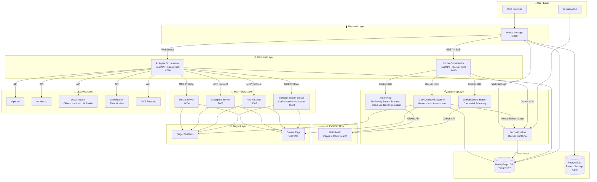
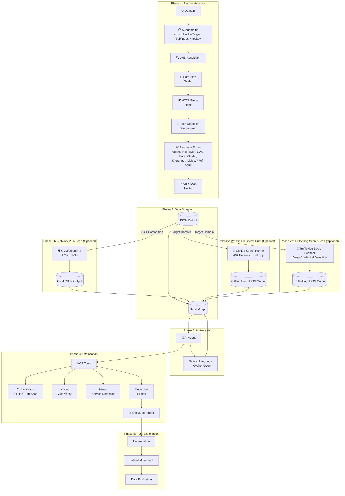
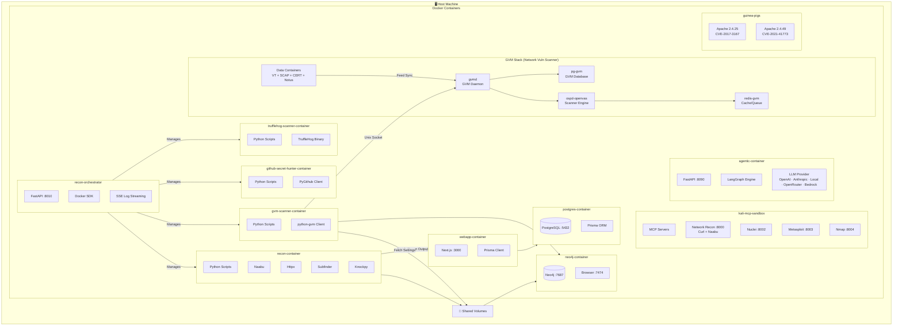
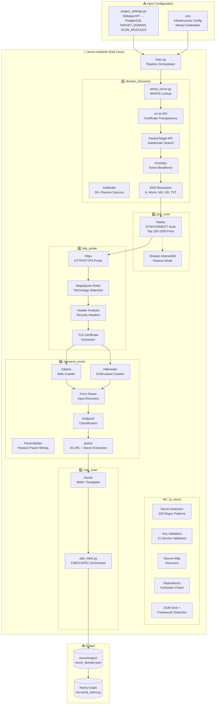
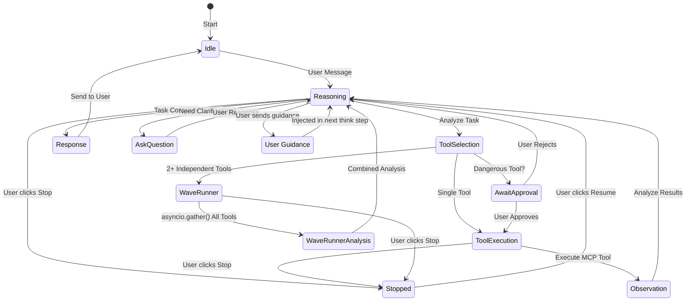
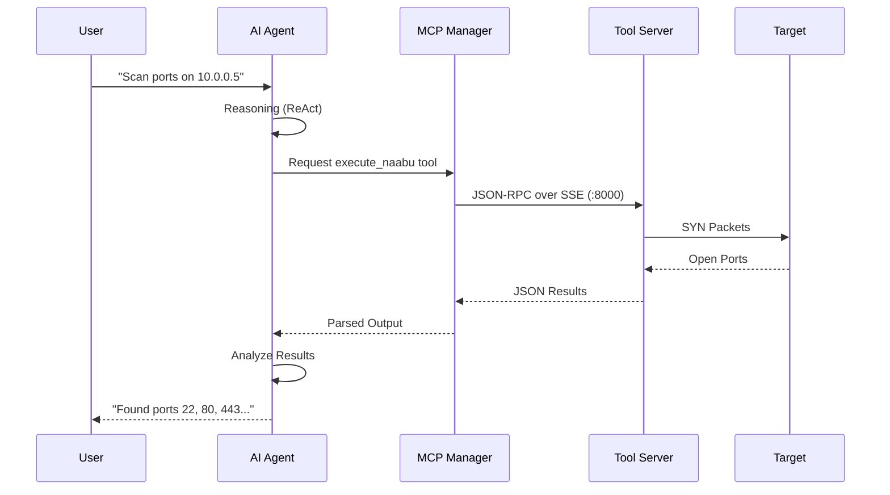

# System Architecture

## High-Level Architecture

## Data Flow Pipeline

## Docker Container Architecture

## Exposed Services & Ports

> **Host-exposure policy (since 5.3.1).** Only the webapp (`3000`), the agent
> API (`8090`) and the reverse-shell listener (`4444`) are published on all
> interfaces. Everything else in this table is bound to **`127.0.0.1` only** —
> reachable from the host for debugging, not from the LAN. The MCP servers
> (`8000-8005`) additionally require `Authorization: Bearer $MCP_AUTH_TOKEN`;
> the agent supplies it automatically over the internal Docker bridge. See
> [README.MCP.md](README.MCP.md#security-notice) and STRIDE S10/E1/I9/S13.

| Service | URL | Exposure | Description |
|---------|-----|----------|-------------|
| **Webapp** | http://localhost:3000 | LAN | Main UI — create projects, configure targets, launch scans |
| PostgreSQL | 127.0.0.1:5432 | Loopback | Primary database (Prisma) |
| Neo4j Browser | http://127.0.0.1:7474 | Loopback | Graph database UI for attack surface visualization |
| Neo4j Bolt | 127.0.0.1:7687 | Loopback | Neo4j driver protocol (used by agent) |
| Recon Orchestrator | http://127.0.0.1:8010 | Loopback | Manages recon pipeline containers. **Network-isolated:** on its own `redamon-orchestrator-net` (not `redamon`) — reachable from the host and the webapp, but not from the worker. |
| Agent API | http://localhost:8090 | LAN | AI agent WebSocket + REST API |
| MCP Network Recon | http://127.0.0.1:8000/sse | Loopback + token | curl + naabu (HTTP probing, port scanning) |
| MCP Nuclei | http://127.0.0.1:8002/sse | Loopback + token | Nuclei vulnerability scanner |
| MCP Metasploit | http://127.0.0.1:8003/sse | Loopback + token | Metasploit Framework RPC |
| MCP Nmap | http://127.0.0.1:8004/sse | Loopback + token | Nmap network scanner |
| Metasploit Progress | http://127.0.0.1:8013 | Loopback | Live progress streaming for long-running exploits |
| Tunnel Manager | http://127.0.0.1:8015 | Loopback | ngrok/chisel tunnel configuration API |
| RedAmon Terminal | ws://127.0.0.1:8016 | Loopback | Kali sandbox PTY shell access (xterm.js; browser reaches it via the agent proxy) |
| Metasploit Listener | 0.0.0.0:4444 | LAN (by design) | Reverse shell listener — a target connects back here in direct/no-tunnel mode |

## Recon Pipeline Detail

## Agent Workflow (ReAct Pattern)

## MCP Tool Integration

